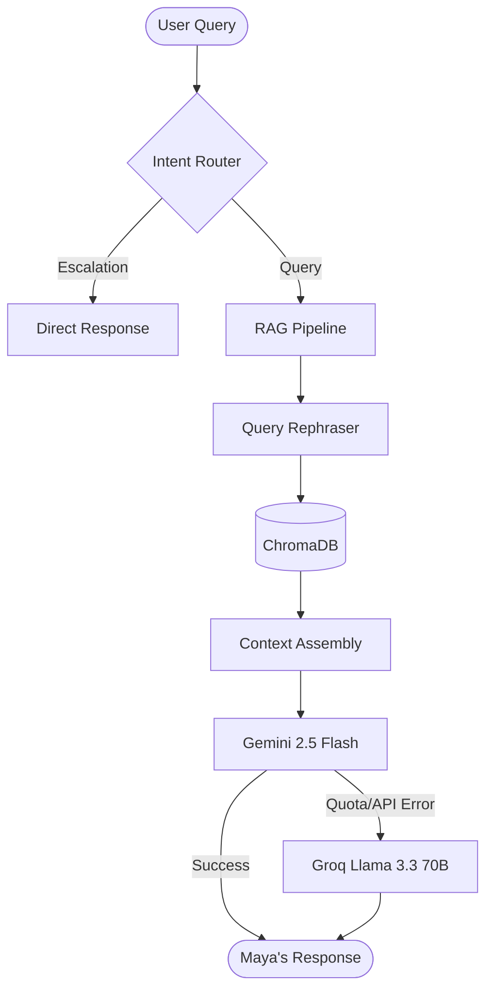

# Magppie AI Concierge

<div align="center">
  
  <br><br>
  <strong>Maya — Elite Digital Concierge for Magppie</strong>
  <br>
  <em>An enterprise-grade RAG solution featuring multi-provider redundancy and seamless lead capture.</em>
  <br><br>

  [](https://www.python.org/)
  [](https://streamlit.io/)
  [](https://langchain.com/)
  [](https://ai.google.dev/)
  [](https://groq.com/)

</div>

---

## 📖 Executive Summary

**Maya** is a high-performance, Retrieval-Augmented Generation (RAG) assistant designed for [Magppie](https://www.magppie.com). Unlike generic chatbots, Maya is strictly grounded in Magppie's proprietary knowledge base (product catalogues and web presence), delivering zero-hallucination responses with an elite concierge persona.

Built for mission-critical customer engagement, the system features a robust **dual-engine fallback architecture**, ensuring 99.9% availability even during primary provider outages.

---

## ✨ Key Capabilities

| Feature | Technical Implementation |
|---|---|
| 🧠 **Intelligent RAG** | Hybrid ingestion from PDF (OCR-ready) and dynamic Web Crawling via ChromaDB. |
| 🛡️ **Zero-Downtime Fallback** | Automatic failover from Gemini 2.5 Flash to Groq (Llama 3.3 70B) on API errors. |
| 💬 **Contextual Memory** | Advanced multi-turn session awareness with query-rephrase optimization. |
| 🎯 **Intent-Based Routing** | Algorithmic detection of escalation, lead generation, and informational queries. |
| 📋 **CRM Bridge** | Real-time lead capture and validation with structured JSON persistence. |
| 🏗️ **Cold-Start Optimized** | Pre-indexed vector store support for instantaneous deployment on Streamlit Cloud. |
| 🎨 **Bespoke UI** | Premium three-panel layout featuring gold accents and custom DM Sans typography. |

---

## 🖼️ Visual Gallery

> *Experience Maya's premium interface in action.*

| **Conversational Interface** | **Lead Generation** | **Escalation Logic** |
|:---:|:---:|:---:|
|  |  |  |

---

## 🏗️ System Architecture

### 🛡️ High-Availability LLM Pipeline
Maya implements a "Silent Fallback" pattern to maintain a premium user experience regardless of API status.



### 🗂️ Data Ingestion Strategy
1.  **Static**: Deep parsing of `magppie.pdf` using PyMuPDF with Tesseract OCR for embedded images.
2.  **Dynamic**: BFS-based web crawling of `magppie.com` with Playwright fallback for JS-heavy pages.
3.  **Vectorization**: Semantic chunking (RecursiveCharacterSplitter) stored in ChromaDB using `gemini-embedding-001`.

---

## 🛠️ Project Structure

```text
├── assets/                     # Brand assets (base64-encoded for UI)
├── chatbot/
│   ├── lead_capture.py         # Lead validation & persistence logic
│   └── logic.py                # Intent routing (Escalation/Lead/RAG)
├── ingestion/
│   ├── chunker.py              # Semantic text splitting
│   ├── pdf_loader.py           # Multi-modal PDF extraction (OCR)
│   └── web_scraper.py          # BFS Crawler with JS-rendering support
├── rag/
│   ├── embedder.py             # Google Generative AI Embeddings
│   ├── pipeline.py             # Core RAG orchestrator & Fallback logic
│   └── vector_store.py         # ChromaDB management & auto-build
├── ui/
│   └── app.py                  # Main Streamlit application
└── build_knowledge_base.py     # Orchestration script for DB initialization
```

---

## 🚀 Rapid Deployment

### 1️⃣ Local Environment Setup
```bash
# Clone & Navigate
git clone https://github.com/Durga200422/magppie-ai-customer-chatbot.git
cd magppie-ai-customer-chatbot

# Environment Initialization
python -m venv venv
source venv/bin/activate  # venv\Scripts\activate on Windows
pip install -r requirements.txt
```

### 2️⃣ Configuration
Create a `.env` file based on `.env.example`:
```env
GEMINI_API_KEY=your_key
GROQ_API_KEY=your_key
```

### 3️⃣ Initialization & Launch
```bash
# Build the knowledge base (First run only)
python build_knowledge_base.py

# Launch the concierge
streamlit run ui/app.py
```

---

## ☁️ Streamlit Cloud Deployment

Maya is optimized for **Streamlit Community Cloud**. 

1.  **Repository**: Ensure `chroma_db/` is committed for the fastest "Cold Start" performance.
2.  **Secrets**: Configure `GEMINI_API_KEY` and `GROQ_API_KEY` in the Streamlit Cloud Settings.
3.  **Persistence**: Lead capture writes to `leads/leads.json` (Note: ephemeral filesystem rules apply).

---

## 🔧 Troubleshooting & Dependencies

*   **OCR Support**: Requires `Tesseract` installed on the host machine for image-text extraction.
*   **JS Rendering**: Web scraper uses `Playwright` (optional) for enhanced content discovery.
*   **Rate Limits**: The ingestion script handles `429 RESOURCE_EXHAUSTED` errors with exponential backoff.

---

## 📜 License & Credits

Distributed under the MIT License. Built with ❤️ for the Magppie Brand experience.

<div align="center">
  <p><em>Premium Design by Antigravity AI</em></p>
</div>
